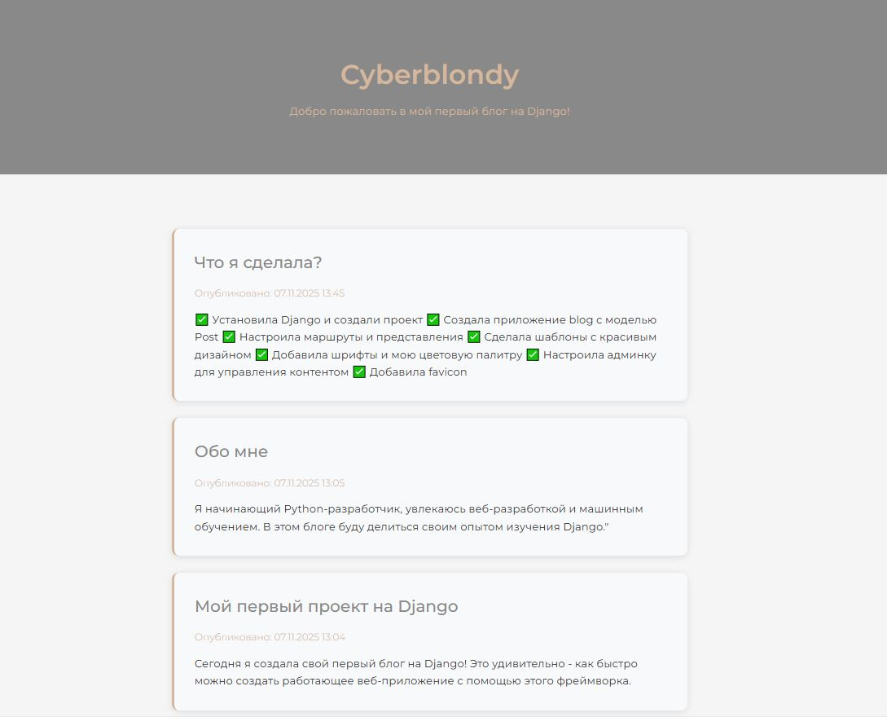
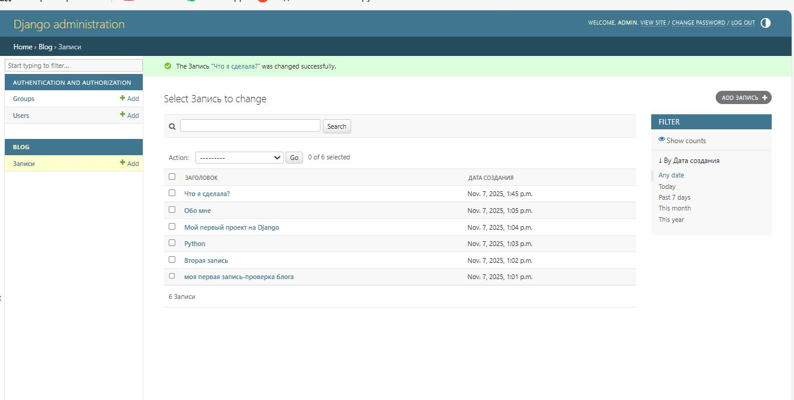

# Django Blog Project

Мой первый блог на Django с современным дизайном и адаптивной версткой.

## 🎥 Demo

### Главная страница блога


### Админ-панель для управления контентом


## 🛠 Tech Stack


## 🚀 Features
- Чистый и современный дизайн
- Адаптивная верстка
- Админ-панель для управления контентом
- Шрифт Montserrat
- Кастомная цветовая палитра
## 📁 Project Structure
```
MyBlog/
├── blog/ # Django application
├── static/ # CSS, images
├── MyBlog/ # настройки проекта 
└── manage.py # Django management script
```

## 🚀 Quick Start
```bash
# Install dependencies
pip install django

# Run migrations
python manage.py migrate

# Create superuser
python manage.py createsuperuser

# Run server
python manage.py runserver
```

🌐 Live Demo
Visit: http://127.0.0.1:8000/

📝 License
MIT License
